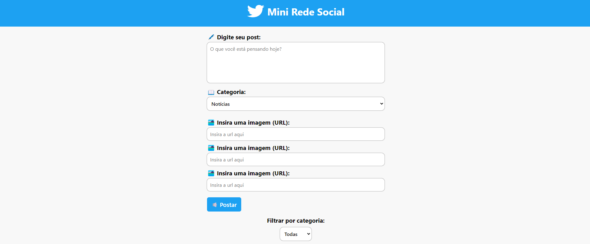

# INTEGRANTES
- **[Kaique Zaffarani](https://github.com/Z4ffarani)**
- **[Guilherme Santos Nunes](https://github.com/sannunez)**
- **[Henry Evideira Paulo](https://github.com/Hep4xl0)**

<br>

# PROJETO
Mini Rede Social é um site que imita uma rede social, permitindo a criação de publicações categorizadas com imagens e textos. Os usuários podem visualizar, filtrar, editar e excluir posts, além de alternar entre as categorias usando carrosséis para exibição de múltiplas imagens.

As categorias presentes são:
- **Notícias** | Para postagens de informações atuais relevantes. 
- **Dicas** | Para conselhos e sugestões sobre variados assuntos.
- **Eventos** | Para registros de momentos cotidianos ou especiais.
 
<br>

# INSTRUÇÕES
1. Em um terminal, clonar o repositório:
```bash
git clone https://github.com/Z4FFARANI-EDUCATIONAL/SEM1-CP3-WEB-DEVELOPMENT.git
```

2. No terminal, navegar até a pasta do projeto:
```bash
cd SEM1-CP3-WEB-DEVELOPMENT/site
```

3. Acessar o site executando o arquivo: `index.html`
   
<br>

# FUNÇÕES
- **Criação de posts** | O usuário pode criar um post, adicionando texto, selecionando uma categoria e inserindo até três URLs (localizador uniforme de recursos) de imagens.
- **Carrossel de imagens** | Para cada post criado, as imagens associadas são exibidas em um carrossel interativo.
- **Data e hora** | Cada post é registrado com a data e hora da publicação.
- **Filtro por categoria** | É possível filtrar os posts por categoria específica ou visualizar todos simultaneamente.
- **Edição de posts** | O usuário pode editar o conteúdo de um post após sua criação.
- **Exclusão de posts** | O usuário pode apagar um post quando quiser.

<br>

# OBSERVAÇÕES
- Se uma imagem não for fornecida, um `placeholder` padrão será exibido.
- O projeto segue uma estrutura simples utilizando HTML, CSS e JavaScript. Todos os arquivos estão localizados no mesmo diretório, sendo `index.html`, `index.css`, e `script.js` os principais arquivos do projeto.
- O layout do site utiliza unidades relativas para margem e tamanho de fonte.
- O projeto pode ser facilmente expandido para incluir funcionalidades mais avançadas, como interações entre usuários, curtidas em posts e comentários

<br>

# TECNOLOGIAS
[](https://developer.mozilla.org/pt-BR/docs/Web/HTML)
[](https://developer.mozilla.org/pt-BR/docs/Web/CSS)
[](https://developer.mozilla.org/pt-BR/docs/Web/JavaScript)

<br>

# AGRADECIMENTOS
- **[Caio Vinícius Gonçalves de Oliveira](https://github.com/caiooliveira-tech)**
